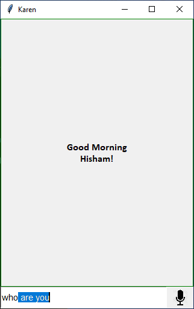
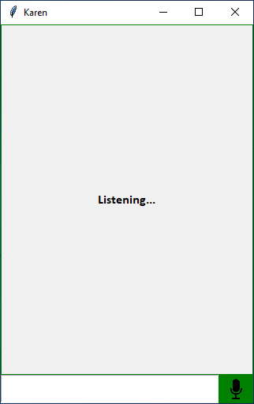
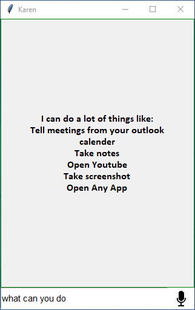

    
    
    

PROJECT KAREN
-------------
A smart personalized digital assistant that makes your life easier

FEATURES:
- Wake word detection
- Offline mode
- Voice/Text mode
- Easily add new skills
- CLI and GUI interface

COMMANDS:
- Take screenshot
- Open Youtube
- Shutdown PC
- Lock PC
- Take Notes
- Search Google
- Search Wikipedia
- Check internet connection
- Test internet speed
- Control TV
- Tells time
- Tells weather
- Open Apps
- Read copied text
- Tells news
- Take picture

ADDING NEW SKILLS:
- Create new python file with following requirements:
    - create list of commands in format and define functions for each one with one parameter which receives the actual command:
        command = [
                   [skill_name, function_name1, [list of commands for function1]],
                   [skill_name, function_name2, [list of commands for function2]],
                  ]
    - add "enable = True" to enable skill
    - copy this file to skills directory and import it in __init__.py:
        import skill_name

FRAMEWORKS:
- Tkinter (GUI)
- Numpy (Scientific)
- Selenium (Web automation)
- BeautifulSoup (Web scraping)
- Flask (Web development)
- SQLite (Database)
- Git (Version Control)

TODO:
-----
- develop web interface using flask
- add skill: news using api
- add skill: location using api
- add skill: search google using url
- add skill: take picture using camera
- fix command test internet speed 
- add skill: open youtube using url
- add skill: take notes in notepad
- fix control tv
- add skill: track using database, social media (Facebook, Instagram, Snapchat)
- add skill: facial recognition using opencv
- add smart-skill: digital care using screentime
- improve command matching using regex

CHANGELOG:
----------

v0.1: (02-07-2021)
- Added CLI interface

v0.2: (14-07-2021)
- Added Tkinter: GUI interface 

v0.3: (06-08-2021)
- added skill word dictionary
- added skill system stats
- added skill wolframalpha
- added skill play music
- added weather api

